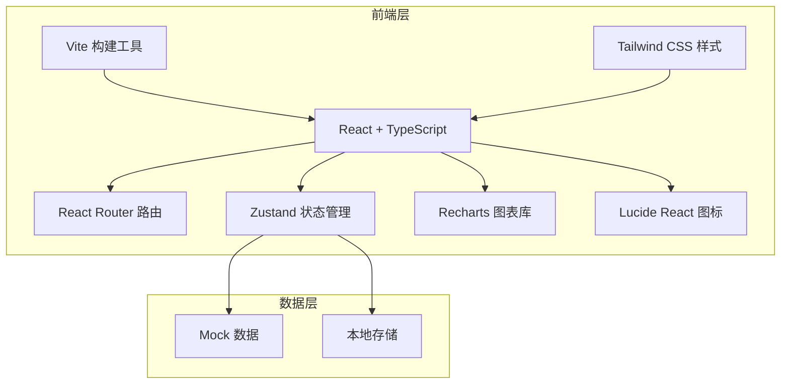
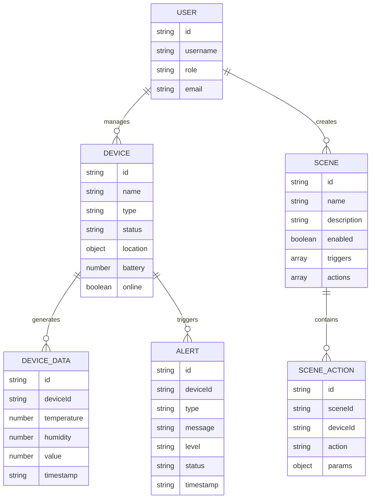

# PC端物联网控制平台 - 技术架构文档

## 1. Architecture Design

## 2. Technology Description
- **Frontend**: React@18 + TypeScript + Tailwind CSS@3 + Vite
- **Initialization Tool**: vite-init
- **Backend**: 无（使用 Mock 数据）
- **Database**: 本地存储 LocalStorage
- **图表库**: Recharts
- **状态管理**: Zustand
- **路由**: React Router v6
- **图标**: Lucide React

## 3. Route Definitions
| Route | Purpose |
|-------|---------|
| / | 首页仪表板 |
| /devices | 设备管理 |
| /control | 设备控制 |
| /monitor | 数据监控 |
| /scenes | 智能场景 |
| /platform | 平台管理 |

## 4. API Definitions
无后端 API，使用 Mock 数据

## 5. Server Architecture Diagram
无后端服务器

## 6. Data Model

### 6.1 Data Model Definition

### 6.2 Data Definition Language
无数据库，使用 LocalStorage 存储
