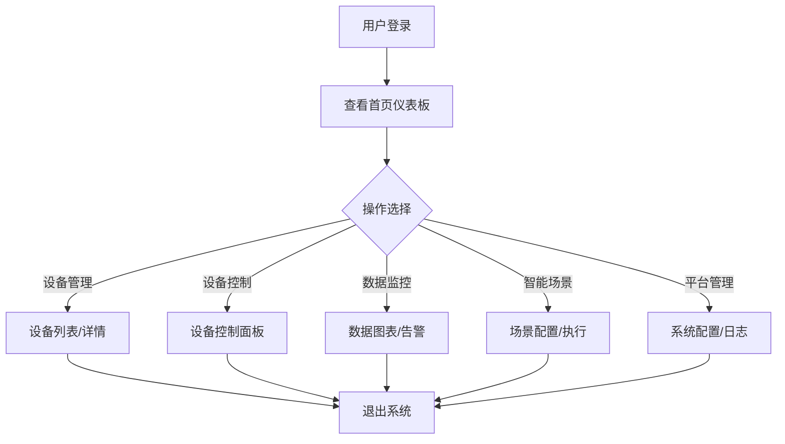

# PC端物联网控制平台 - 产品需求文档

## 1. Product Overview
物联网控制平台PC端应用，提供专业的设备管理、控制、监控和数据分析功能，面向企业级用户。
- 主要用途：管理和控制各类智能物联网设备，监控设备状态和数据，配置自动化场景
- 目标用户：企业运维人员、智能家居管理员、物联网平台管理员

## 2. Core Features

### 2.1 User Roles
| Role | Registration Method | Core Permissions |
|------|---------------------|------------------|
| 管理员 | 用户名/密码登录 | 完全访问权限，设备管理，用户管理，平台配置 |
| 操作员 | 用户名/密码登录 | 设备控制，数据查看，场景执行 |

### 2.2 Feature Module
1. **首页仪表板**: 设备概览，数据统计，快捷操作
2. **设备管理**: 设备列表，设备详情，设备添加/编辑/删除
3. **设备控制**: 实时控制，参数调节，批量操作
4. **数据监控**: 实时数据，历史数据图表，告警中心
5. **智能场景**: 场景配置，自动化规则，定时任务
6. **平台管理**: 用户管理，系统配置，日志审计

### 2.3 Page Details
| Page Name | Module Name | Feature description |
|-----------|-------------|---------------------|
| 首页仪表板 | 设备概览卡片 | 显示在线/离线设备数量，设备类型分布 |
| 首页仪表板 | 实时数据面板 | 展示关键传感器数据，温湿度、电量等 |
| 首页仪表板 | 快捷操作区 | 快速访问常用功能，一键执行场景 |
| 设备管理 | 设备列表 | 可筛选、搜索、排序的设备表格 |
| 设备管理 | 设备详情 | 设备信息、状态、历史数据、控制操作 |
| 设备控制 | 控制面板 | 实时控制设备开关、调节参数 |
| 设备控制 | 批量操作 | 多选设备统一控制 |
| 数据监控 | 实时数据图表 | 实时更新的折线图、柱状图 |
| 数据监控 | 历史数据查询 | 按时间范围查询历史数据 |
| 数据监控 | 告警中心 | 设备告警列表，告警处理 |
| 智能场景 | 场景列表 | 已配置场景列表，启用/禁用 |
| 智能场景 | 场景编辑器 | 可视化配置场景触发条件和动作 |
| 平台管理 | 用户管理 | 用户列表、添加、编辑、权限配置 |
| 平台管理 | 系统日志 | 操作日志、系统日志查询 |

## 3. Core Process
用户登录系统 → 查看首页仪表板了解设备状态 → 进入设备管理查看详细信息 → 使用设备控制进行操作 → 配置智能场景自动化 → 通过数据监控分析设备运行情况

## 4. User Interface Design
### 4.1 Design Style
- **主色调**: 深蓝色 (#1e40af) 配合天蓝色 (#3b82f6) 作为点缀
- **辅助色**: 灰色系 (#f3f4f6, #e5e7eb, #9ca3af)
- **按钮风格**: 圆角矩形，主按钮蓝色填充，次要按钮边框样式
- **字体**: 无衬线字体，标题 18-24px，正文 14px，小字 12px
- **布局风格**: 左侧侧边栏导航 + 顶部工具栏 + 内容区域卡片式布局
- **图标风格**: 使用 linear 风格图标，简洁专业

### 4.2 Page Design Overview
| Page Name | Module Name | UI Elements |
|-----------|-------------|-------------|
| 首页仪表板 | 设备概览卡片 | 网格布局，4列卡片，渐变背景，图标+数字展示 |
| 首页仪表板 | 实时数据面板 | 左右分栏，左侧数据卡片，右侧折线图表 |
| 设备管理 | 设备列表 | 表格布局，可展开行，筛选栏在顶部 |
| 设备控制 | 控制面板 | 分组卡片布局，滑块、开关、按钮控件 |
| 数据监控 | 实时数据图表 | 全屏图表区域，时间轴控制，图例切换 |
| 智能场景 | 场景编辑器 | 拖拽式可视化编辑器，条件+动作卡片 |

### 4.3 Responsiveness
- **Desktop-first**: 主要针对 PC 端优化，支持 1280px+ 分辨率
- **响应式适配**: 自适应不同屏幕尺寸，最小支持 1024px
- **触控优化**: 支持大屏触控操作，按钮和交互区域足够大

### 4.4 3D Scene Guidance
- 不适用 3D 场景
